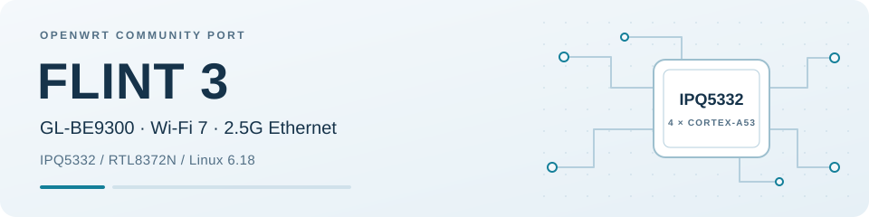

<p align="center">
  <picture>
    <source media="(prefers-color-scheme: dark)" srcset="docs/assets/flint3-banner-dark.svg">
    
  </picture>
</p>

<p align="center">
  <a href="https://github.com/perceival/openwrt-flint3"></a>
  <a href="#hardware"></a>
  <a href="#hardware"></a>
  <a href="https://github.com/perceival/openwrt-flint3/releases"></a>
</p>

<p align="center">
  <a href="#download-images"><b>Downloads</b></a> ·
  <a href="#status"><b>Status</b></a> ·
  <a href="#known-issues"><b>Known issues</b></a> ·
  <a href="#installing"><b>Installation</b></a> ·
  <a href="#building"><b>Build</b></a> ·
  <a href="#roadmap"><b>Roadmap</b></a> ·
  <a href="#contributing"><b>Contribute</b></a>
</p>

# OpenWrt for the GL.iNet Flint 3 (GL-BE9300)

Community-maintained **OpenWrt** support for the **GL.iNet Flint 3 (GL-BE9300)** — Qualcomm
**IPQ5332** (quad Cortex-A53) with tri-band Wi-Fi 7, a Realtek **RTL8372N** 10G
switch and a **RTL8221B** 2.5G WAN PHY.

> [!IMPORTANT]
> **This branch (`flint3-be9300`) is a complete, buildable OpenWrt tree.**
> Clone it and build — there is nothing to drop into another checkout.
> (An earlier `main` branch held a target *overlay*; it is retired and
> preserved at the tag `archive/main-overlay`.)

Target: **`qualcommbe/ipq53xx`** · Kernel: **Linux 6.18** · Tested board: **GL-BE9300**.

> [!WARNING]
> **Unofficial, community-maintained port — not affiliated with, endorsed by, or supported
> by GL.iNet or the OpenWrt project.** Provided **as-is, with no warranty of any kind**.
> Flashing third-party firmware carries real risk, including bricking the device, and may
> void your hardware warranty. **Back up your eMMC first** — the ART partition holds your
> unit's unique radio calibration data and MAC addresses and cannot be recovered from
> anywhere else. If this router matters to you, test on a spare unit before relying on it.

## Download images

Pre-built reference images are published periodically on the
**[Releases page](https://github.com/perceival/openwrt-flint3/releases)**.
The published reference batches are **prereleases**, not official OpenWrt images.
Read the release notes, build manifests and checksums for the exact image you choose.

| Profile | Intended use | Included configuration |
| --- | --- | --- |
| **`vanilla`** | Minimal default OpenWrt | The exact, unmodified default this tree produces with zero customization: **no LuCI**, `wpad-basic-mbedtls`; what you get building it yourself with no changes |
| **`ap`** | Access point | Full config with **LuCI** and tri-band **MLO**, plus the FT-over-MLO roaming series described in the release manifest; the maintainer's household profile. See the [FT/MLO limitation](#known-issues) |
| **`router`** | Gateway | **LuCI**, WireGuard, unbound, chrony and mDNS reflection; nftables flowtable offload in software by default, **PPE hardware offload opt-in** (see [Status](#status)) |

For **stock → OpenWrt**, choose the **factory** image and follow
[Installing](#installing). For an existing build of this port, choose the
**sysupgrade** image. The **initramfs** image is a separate RAM-boot image;
follow the device-page procedure for its use.

See the disclaimer above before flashing any of them. Keep the image's checksum
file and build manifest with your download.

## Status

The latest published reference images are from [`ref-20260930`](https://github.com/perceival/openwrt-flint3/releases/tag/ref-20260930). The rows below describe the **shipping RTL837x driver** and maintainer-reported GL-BE9300 results. Image inclusion, a successful build and a hardware test are different kinds of evidence; check the exact profile manifest before flashing.

| Area | Shipping firmware status | Evidence and limits |
| --- | --- | --- |
| Boot, install and recovery | ✅ Reported working | The exact `router` and `vanilla` reference images passed a wiped-overlay first boot, reached `procd`, brought up LAN and DHCP; SSH is reported working on the shipping baseline. eMMC sysupgrade and return to stock are reported working; see the hardware-verified device instructions. |
| Ethernet and basic VLAN | ✅ Reported working | RTL8372N DSA LAN via EDMA/PPE, bridge VLANs and the RTL8221B 2.5G USXGMII WAN (linking at 2.5 Gbps) are reported working on the existing driver. Throughput between two units over a 2.5G trunk was ~1.8–1.9 Gbit/s. This does not validate the replacement driver in [#104](https://github.com/perceival/openwrt-flint3/pull/104). |
| Wi-Fi 7, MLO, DFS, 802.11k/v | ✅ Reported working | Maintainer reports cover all three bands, tri-band AP MLO, multiple BSSes on DFS radios and 802.11k/v. Exact image and client/topology still matter. |
| 802.11r roaming with MLO | ⚠️ Experimental and image-specific | Only the AP reference profile includes the `992–999a` hostapd series. `999a` is marked **not hardware-verified**; a separate post-FT data-path failure remains reported. `vanilla` and `router` reference images do not include the series. |
| PPE hardware flow offload | 🟡 Opt-in, limited | In `ref-20260930`, IPv4 LAN→WAN SNAT for TCP/UDP is reported at ~2.3 Gbit/s and ~1% CPU, on untagged or 802.1Q-tagged WAN. Tagged-WAN download traffic, WAN→LAN hardware offload and IPv6 hardware offload are not included. See the [detailed shipping-feature matrix](docs/feature-status.md#shipping-firmware-existing-rtl837x-driver). |
| LAG and egress rate policing | 🧪 Open PRs; not in the reference images | [#47](https://github.com/perceival/openwrt-flint3/pull/47) and [#49](https://github.com/perceival/openwrt-flint3/pull/49) target the existing driver. Prior-head hardware measurements are recorded in the PRs; the current PR heads still need their own build and validation. |
| Fan response near the first thermal trip | ⚠️ Known behavior under review | Two units measured 48.7 °C / 14% / 1126 rpm and 50.4 °C / 50% / 3493 rpm at idle. The finer trip-table change had not reached the tree at the latest [#8 update](https://github.com/perceival/openwrt-flint3/issues/8). |
| Replacement DSA driver | 🧪 Build passed; hardware pending | [Draft #104](https://github.com/perceival/openwrt-flint3/pull/104) passed an ARM64 module build and a full BE9300 AP-config OpenWrt image build for the recorded source revision. **No BE9300 hardware run has been reported for this replacement.** Its separate P1/P2 parity work remains open. |

See the [full feature and validation matrix](docs/feature-status.md) for the exact image revisions, evidence scope, known limits and replacement-driver gaps. “`vanilla`” is this project’s minimal image profile; it does not mean an unmodified upstream OpenWrt target or a catalogue of every generic OpenWrt package.
## Known issues

- **ath12k firmware hang under sustained load.** After hours with many clients
  the Q6 can take a fatal error. Since 2026-09-28 the firmware coredump is
  released automatically and the radios recover in seconds instead of staying
  down; the cause of the crash itself is still open. Reported upstream.
- **Kernel panic in netlink socket release**, seen six times since August on
  both APs after hours of uptime (sockets of a bridge notification, hostapd
  or wsdd2). The AP reboots itself in ~90 s. wsdd2 is kept disabled as one
  trigger; root cause under investigation with a KASAN kernel.
- **Client kicks for "excessive missing ACKs"**: the driver's packet-loss
  events are unreliable for multi-link stations, so hostapd's
  `disassoc_low_ack` now defaults to 0 in these images (set it to 1 on a
  wifi-iface to restore the old behaviour).
- **Earlier PPE NAT port-rewrite regression.** Fixed in [`ref-20260930`](https://github.com/perceival/openwrt-flint3/releases/tag/ref-20260930) by patch 0448. Router images or local builds made from 2026-09-23 through that release with PPE hardware offload enabled could mishandle a firewall-remapped source port. Update affected builds; [the release notes](https://github.com/perceival/openwrt-flint3/releases/tag/ref-20260930) describe the impact and fix. The 2026-09-15 reference images predate this regression.
- **Fan response at idle.** On two units, crossing the first 50 °C thermal trip changed the reported fan from 14% (1126 rpm at 48.7 °C) to 50% (3493 rpm at 50.4 °C). The proposed finer in-tree curve was still unapplied at the latest [issue #8 update](https://github.com/perceival/openwrt-flint3/issues/8).
- **PPE WAN RX FIFO overruns.** Roughly 0.07–0.09 % of packets at ~1.9 Gbit/s.
  No longer the hard ~600 Mbit/s cap earlier builds had, but not zero.
- **802.11r with MLO is experimental.** Do not enable
  11r on an MLO SSID in an image without the FT-over-MLO series: the unpatched
  hostapd FT path has no MLD awareness. The current tree contains patches
  `992–999a`, and the AP reference manifest describes that series. This is
  experimental work: [patch 999a](package/network/services/hostapd/patches/999a-FT-reuse-ANonce-for-a-repeated-auth-with-same-SNonce.patch)
  is explicitly marked **not hardware-verified** and does not resolve the
  separate reported post-FT data-path failure. Check the exact image's release
  notes and tested client/topology before using it. The series targets FT
  over-the-air; [patch 992](package/network/services/hostapd/patches/992-AP-MLD-Add-FT-support-for-non-AP-MLDs.patch)
  does not change FT over-the-DS with AP MLDs. **802.11k/11v are reported working.**

## Hardware

| Block | Detail |
|---|---|
| SoC | Qualcomm IPQ5332, 4× Cortex-A53 |
| Wi-Fi 2.4 GHz | on-SoC radio, ath12k over AHB |
| Wi-Fi 5 / 6 GHz | 2× QCN9274, ath12k over PCIe |
| Switch | RTL8372N, out-of-tree DSA driver (`realtek,rtl837x`); SoC↔switch link is 10GBASE-R |
| WAN | RTL8221B 2.5G, USXGMII |
| Storage | eMMC |

## Installing

Full, hardware-verified instructions — including the round trip back to stock —
are on the device page:

**[GL-BE9300 device page: installation and recovery](https://openwrt.org/toh/gl.inet/gl-be9300)**

Short version: from stock firmware, use the **factory** image with
`sysupgrade -F -n`. The stock image check requires a QSDK FIT, so `-F` is
required and the "missing section" warnings for `u-boot`/`tz`/`sb11` are
expected. Do **not** force the plain sysupgrade image from stock.

Stock QSDK firmware may report `qcom,ipq5332-ap-mi01.6` as its board name.
That is the generic Qualcomm MI01.6/RDP468 identity used by the vendor path,
not the OpenWrt GL-BE9300 device identifier. The same compatible is used by
the upstream Qualcomm RDP468 device tree, so it is intentionally not added to
this profile's `SUPPORTED_DEVICES`: doing so would advertise the Flint 3 image
as compatible with other hardware using that generic identity. The resulting
stock compatibility warning is therefore expected; use the documented `-F`
factory-image path instead (see [issue #9](https://github.com/perceival/openwrt-flint3/issues/9)).

**Back up your eMMC first** — the ART partition holds this unit's radio
calibration and MAC addresses and cannot be recovered from anywhere else.

## Building

```sh
git clone -b flint3-be9300 https://github.com/perceival/openwrt-flint3.git
cd openwrt-flint3
./scripts/feeds update -a
./scripts/feeds install -a
make menuconfig     # Target System: Qualcomm Atheros 802.11be
                    # Subtarget:     ipq53xx
                    # Target Profile: GL.iNet GL-BE9300
make -j"$(nproc)"
```

Images land in `bin/targets/qualcommbe/ipq53xx/`.

Prefer a pre-built image? See [Download images](#download-images) for the three profiles.

## Roadmap

Development links below are a snapshot checked on **2026-10-03**. Follow the
linked issues and PRs for subsequent results and maintainer decisions.

| Track | Current state | Evidence and next step |
| --- | --- | --- |
| **IPQ53xx upstream base** | 🚧 In review | [OpenWrt #23161](https://github.com/openwrt/openwrt/pull/23161) is open; official integration depends on the upstream base |
| **RTL8372N replacement plan** | 🚧 In progress | [#99](https://github.com/perceival/openwrt-flint3/issues/99) coordinates upstream work; [#100](https://github.com/perceival/openwrt-flint3/issues/100) tracks source provenance, required features and acceptance tests |
| **P0: DSA bring-up** | 🧪 Draft candidate; target build passed | [#104](https://github.com/perceival/openwrt-flint3/pull/104): ARM64 module and full BE9300 AP-config image builds passed for the recorded source revision ([module](https://github.com/MNeroba/openwrt-flint3/actions/runs/37059225390), [target image](https://github.com/MNeroba/openwrt-flint3/actions/runs/37059229177)); BE9300 hardware validation remains pending |
| **P1: switching parity** | 🚧 Partial implementation | [Dependent P1-A PR](https://github.com/MNeroba/openwrt-flint3/pull/1): serialized VLAN-table foundation; full bridge/VLAN/FDB/MDB/STP support remains open |
| **LAG / rate limiting** | 🚧 Open PRs for the existing driver | [#47](https://github.com/perceival/openwrt-flint3/pull/47) and [#49](https://github.com/perceival/openwrt-flint3/pull/49); replacement-driver porting and validation follow the agreed P0 → P1 → P2 plan |

The published package remains the working baseline while the replacement is
reviewed. A build pass, an open PR or a checked planning item does not establish
hardware support in a reference image. See #100 for the complete acceptance
criteria and any explicitly agreed feature deferrals.

## Other boards

Only the GL-BE9300 is tested here. The tree is a `qualcommbe/ipq53xx` target, and anything that
is not board-specific — the IPQ5332 clocks, PCIe, PPE/EDMA Ethernet and hardware offload, ath12k
Wi-Fi and the firmware-recovery handler — is shared by every IPQ53xx device. What a new board
needs is a device tree, an image definition and, if its switch is not a Realtek RTL837x, a
matching switch driver.

**Defined in this tree, untested by me** (images are not published for them):

| Board | SoC | Switch | Flash | Origin | Notes |
|---|---|---|---|---|---|
| GL.iNet GL-BE6500 | IPQ5332 + QCN9274 | RTL837x (same driver) | NAND (UBI) | [JiaY-shi](https://github.com/JiaY-shi/openwrt) | closest relative; builds from this tree |
| Ubiquiti UniFi 7 Pro XGS | IPQ5332 | none (single 10G PHY) | eMMC + SPI-NOR | Til Kaiser, upstream [#25185](https://github.com/openwrt/openwrt/pull/25185) | needs a bootloader downgrade (newer ones enforce signatures) |

**Other IPQ53xx devices with community work** (not in this tree):

| Device | SoC | Switch | Status |
|---|---|---|---|
| Xiaomi BE3600 Pro (RN01) | IPQ5312 | Motorcomm YT9215S | ported on top of the upstream ipq53xx PR (Ethernet, storage, boot reported working) — [#23161](https://github.com/openwrt/openwrt/pull/23161) |

**Upstream:** OpenWrt main has no IPQ53xx support yet. The subtarget is proposed in
[openwrt/openwrt#23161](https://github.com/openwrt/openwrt/pull/23161) (open). The RTL8372N
switch driver used here is out of tree and has not been merged into OpenWrt main.

**Testers wanted.** If you own a GL-BE6500, a UniFi 7 Pro XGS or another IPQ53xx device and are
comfortable with a serial console and an eMMC/NAND backup, I would like to hear from you: open an
issue with the model, a boot log from stock and a photo of the board. Board support that nobody
can test stays unpublished, and a second set of hands is the fastest way to change that. PRs
bringing up another board on top of this branch are welcome too.

## Upstream

Patches from this work that have gone upstream or are in review:

- `wifi: ath12k: advertise AP_VLAN interface mode for IPQ5332` (linux-wireless)
- hostapd WDS/AP_VLAN `bss->ctx` fix (applied by Jouni Malinen)
- ath12k `hw_scan` NULL-deref report (with the Qualcomm dev team)

## Contributing

Hardware reports, reproducible bug reports and focused PRs are welcome.
Use the [issue tracker](https://github.com/perceival/openwrt-flint3/issues)
and check existing reports before opening another one.

For a useful report, include:

- Device model and hardware revision; image profile, release tag or source commit.
- Kernel/OpenWrt revision and whether this is a published image or a local build.
- Steps to reproduce, expected/actual behavior and relevant configuration.
- Complete boot/kernel logs and, where relevant, packet captures, counters or pstore.
- For performance or Wi-Fi results: peer/client models, link rates, bands, VLAN/MLO
  setup, offload settings and the measurement method.

Remove passwords, keys and other private data from attachments. For another
IPQ53xx board, also include the stock boot log and board photo requested in
[Other boards](#other-boards).

## Links

- [OpenWrt forum: Flint 3 exploration](https://forum.openwrt.org/t/gl-inet-flint-3-exploration-gl-be9300-ipq5332/250267)
- [GL-BE9300 device page](https://openwrt.org/toh/gl.inet/gl-be9300)
- [Reference images and release notes](https://github.com/perceival/openwrt-flint3/releases)
- [Q6/PAS research notes](2.4GHZ-Q6-PAS-FINDINGS.md)
- [DSA tag-protocol investigation](docs/dsa-tag-protocol-decision.md)
- [PPE TCP offload investigation](docs/ppe-tcp-offload-blocker-20260924.md)
- [Native rtl8_4 / PPE parser alias and bench results](docs/rtl8_4-ppe-alias-20260927.md)

The investigation documents include dated experiments and earlier blockers;
read their recorded revisions and follow-up sections alongside the current
release notes.

## Credits

Built on [JiaY-shi's](https://github.com/JiaY-shi/openwrt) GL-BE6500 tree, which
provided the working IPQ5332 Wi-Fi and RTL837x DSA foundation. Thanks to
everyone contributing hardware findings and testing via the issue tracker and
the forum thread.

The replacement-driver effort also evaluates
[airjinkela's RTL8372N DSA refactor](https://github.com/airjinkela/rtl837x-dsa-driver).
Thanks for the architecture work and detailed review replies; the source-lineage
review and replacement scope are tracked in [#100](https://github.com/perceival/openwrt-flint3/issues/100).
